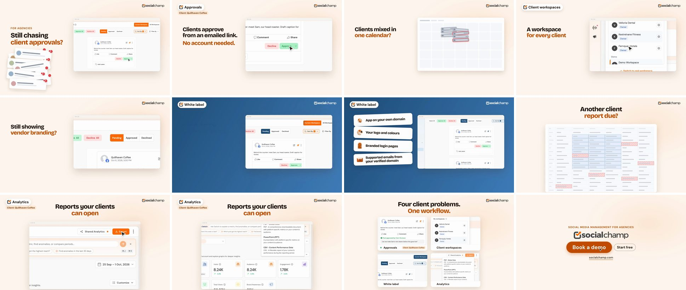

# product-film-kit

**Make a 30 to 60 second product film for a SaaS landing page with Claude Code**:
the short, music-driven video at the top of the page, built from your real product,
cut to the beat, and checked by scripts before anyone watches it.

You describe the product and point Claude at your landing page. The `/product-film`
skill walks Claude through the whole job (story, music, real screens, render, sound
mix) and runs the checks.

## Why this exists

Most "AI product videos" fail in the same few ways: they fake the product UI, they
blur screenshots by scaling them up, they promise things the landing page does not,
their cuts drift off the music, and they read as a feature list nobody finishes.

This kit came out of one real production: a hero film for
[Social Champ](https://www.socialchamp.com)'s agency page that went through twelve
versions. The owner rejected cuts as "too slow", "monotonous", "empty", "blurry" and
finally "it looks nice, but it doesn't have a wow effect". Every rule, check and
recipe here exists because a cut failed without it, and each one names that failure.
The goal is that the next film starts where this one ended, not at version 1.
[Read the case study](plugins/product-film/skills/product-film/references/case-study.md).

## The example film



**[Watch the example (54 s, 1280x720, MP4, 3.6 MB)](media/example-agency-hero-720p.mp4)**
· [poster frame](media/example-agency-hero-poster.png)

Four agency problems, each shown and then solved in the real app: chasing approvals
over email, clients mixed in one calendar, the vendor's branding showing to clients,
and report day. The signature moment (frames 5 and 6) is the real app re-skinning
from Social Champ's orange to a fictional agency's blue, on the biggest lift in the
music. Every product screen is a real render of the shipped app with demo data; the
"before" scenes are graphic mock-ups with no text. The film is Social Champ's own:
its brand, footage and the customer logos in it are not covered by this repo's MIT
licence.

## Who it is for

- Founders and marketers who want a launch or landing-page film without a studio.
- Developers who want the film built as code, so it can be re-rendered whenever the
  product changes.

You need Claude Code. You do not need video-editing software.

## Quick start

1. Install the plugin inside Claude Code:

   ```bash
   /plugin marketplace add SameerKhan/product-film-kit
   /plugin install product-film@product-film-kit
   ```

2. Ask for a film, for example:

   > Make a 50 second hero film for our agency page at https://example.com. Build it
   > around the problems our buyers have, use real screens from the app, and cut it
   > to an upbeat track.

   Or type `/product-film` to start the guided workflow.

3. Claude asks you the decisions only you can make (the buyer problems, the pain
   lines, the track, what may never appear on screen, who signs off) and shows you
   stills and a cut before anything is published.

## Step by step

The whole job from your side, in nine steps: brief, story, music, a critiqued plan,
real screens, mock-ups, a rehearsal that cannot publish, sign-off and delivery, then
ad cut-downs. Each step says what you tell Claude, what it asks you, what it runs and
what to check. **[Read the walkthrough](plugins/product-film/skills/product-film/references/walkthrough.md)**,
which also has prompts for giving feedback and a troubleshooting table.

## Examples to start from

Copy one of these into Claude Code and edit it:

| Film | Prompt |
|---|---|
| Problem-led landing-page hero | "Make a 50 s hero for our agency page. Build it as four problems our buyers have, each shown before and solved in the real app after. One signature moment on the biggest lift. Real screens only, square version too." |
| Single feature launch, 30 s | "We just shipped bulk scheduling. Make a 30 s launch film: the problem in one line, the real flow, the result, the call to action. Crisp style, cut to a 120 BPM track." |
| Brand introduction | "Make a 45 s intro film for new visitors in the chapter style: a title card per feature, the brand pill, playful stickers, our three core features only." |
| White-label or theme moment | "Capture the same screen in our brand and in a fictional agency's brand, and use the switch as the signature moment on the biggest lift. Show me the pair first." |
| Re-render after a release | "The approvals screen changed. Recapture only that scene from the new build, re-render, and re-run every check." |
| Pre-launch, nothing to run yet | "Use our design-file exports for the screens (never AI-generated UI), label them Preview, and keep every claim on the roadmap wording." |
| Ads from an approved film | "From the approved hero, make a 15 s and a 6 s cut and a 9:16 version, ending on the call to action." |

## What you get

- A landscape (16:9) and a square (1:1) master, a 1080p and a 720p web encode, a
  square web encode and a poster frame.
- The result of every check, and a manifest of exactly which inputs and scripts
  produced the files.
- Short ad cut-downs (15 s and 6 s) once the main film is approved.

## Tell a story, not a feature list

The structure that finally worked (details:
[story](plugins/product-film/skills/product-film/references/story.md)):

| Beat | On screen |
|---|---|
| Hook | the first pain line, with the product already on screen |
| Each problem, before | a short pain question in the buyer's words, over a graphic of their bad day |
| Each problem, after | the real product solving it; the camera pushes in on the action |
| Recap | every solved state side by side, one outcome line |
| Proof | logos or a quote you have cleared |
| Ask | one call to action, pressed on the final hit of the music |

What moved the owner from "nice" to "wow": showing the pain instead of naming it,
one signature moment on the biggest music lift (a real re-skin, see
[rebrand capture](plugins/product-film/skills/product-film/references/rebrand-capture.md)),
camera pushes on every payoff, and an escalation measured in events per beat.

## Three styles

| Style | Looks like | Good for |
|---|---|---|
| **Crisp real-app** | the product window fills the screen; real clicks and typing, pin-sharp | proving the product exists and works |
| **Chapter** | bright background, a brand label naming each feature, title cards between sections | a first introduction to a brand |
| **Problem-led story** | crisp real-app footage arranged as buyer problems, with graphic "before" scenes and one signature moment | a landing-page hero that should make the buyer think "that is my week" |

Details and pitfalls: [styles](plugins/product-film/skills/product-film/references/styles.md).

## How it works

| Step | What happens | Why it matters |
|---|---|---|
| 1. Copy | the landing page's text is saved; every word on screen must come from it or be approved by you | the film never promises what the page does not |
| 2. Story | three or four buyer problems, pain lines you approve, one signature moment | the film builds instead of listing |
| 3. Music | the track is measured (tempo, bars, where it lifts and drops) before the storyboard | scene changes and the big moment land on real musical events |
| 4. Screens | real product screens from a local copy of your app, offline, with demo data, at 2x | no fake UI, no real customer data, nothing ever enlarged |
| 5. Build | the film is an HTML page with GSAP animation, generated from a bar-indexed timeline, rendered to MP4 | change a line, re-render; no manual editing |
| 6. Sound | one continuous music excerpt, sound effects peak-aligned to each visual event, mixed for the web | it sounds polished on a laptop, a phone and headphones |
| 7. Checks | scripts read every frame and the mix, and stop the build on any failure | you review a film that already passed |
| 8. Sign-off | a rehearsal renders and checks everything without publishing; you approve; the real run delivers | nothing reaches the final folder without your approval |

## The checks

Every check must pass, and every check is itself tested on each run with a planted
defect it must catch. Recipes: [checks guide](plugins/product-film/skills/product-film/references/qa-gates.md).

- **Words**: every on-screen string comes from your page or your approval, and stays
  on screen long enough to read (0.3 s per word plus 0.9 s).
- **Sharpness**: no screenshot is ever drawn above the size it was captured, on any
  frame; each held screen matches its source capture (SSIM 0.97 or better).
- **Truth**: what the film shows matches the real app (a Pending post is never shown
  as Approved); a re-skin is proven by colour on the surfaces that change, before and
  after.
- **Nothing empty, nothing leaked**: no frame is background only; nothing from a
  hidden scene is painted.
- **Camera and events**: each payoff push reaches its zoom and comes back in time;
  every scheduled visual event actually happens on screen.
- **Mock-ups hold no text** (no words, generated text or images), checked in the page
  and by reading the rendered frames.
- **Names**: no real business or customer name appears in any frame.
- **Sound**: the music lifts where the story turns, every scene change has an audible
  accent, every visual event has its sound, and loudness meets web standards (-14 LUFS).
- **Final files**: every string is readable in every delivered file.
- **You**: a final watch with sound, muted at the size it will sit on the page, and in
  the square format. No script replaces this.

## Safety, and who signs off

- Real-app capture runs offline against a local build, with every network request
  blocked or answered by fixtures, inside a macOS sandbox profile that cannot read
  the rest of your files or reach other local services.
- Your decisions, approvals of captured footage and mock-ups, and the approval of the
  scripts themselves live in a folder the pipeline's sandboxes cannot read or write;
  the pipeline refuses to run if anything you approved has changed.
- Nothing is published or pushed anywhere by the pipeline. Publishing is always a
  separate decision.

Details, including every sandbox fact and tooling trap we hit:
[pipeline and operations](plugins/product-film/skills/product-film/references/pipeline-ops.md).

## What you need

**Required**

| Tool | Used for |
|---|---|
| Claude Code | running the skill |
| `ffmpeg` | measuring music, mixing sound, checking frames, encoding |
| Python 3.9 or newer | the helper scripts (no extra packages) |
| Node 22 and [HyperFrames](https://github.com/heygen-com/hyperframes) | rendering the HTML page to MP4 (any deterministic HTML-to-video renderer works) |

**Optional**

| Tool | Used for |
|---|---|
| Playwright with Google Chrome | capturing real screens from your app |
| A Mac with `swiftc` | the every-frame text checks (Apple's on-device text recognition) |
| An image model | illustrations for text-only scenes (never product UI) |
| A licensed music track | Claude helps choose; you supply the licence |

## Ground rules the kit enforces

- **No AI-generated product screens.** Real app or design-file exports only. AI is
  fine for illustrations, and graphic mock-ups are plain shapes, never your UI.
- **No test signups on your live site.** They pollute analytics and your CRM.
- **Licences respected.** Music that may not be remixed is one unbroken excerpt;
  every asset is logged with its licence.
- **Product bugs found while filming are reported, never hidden.**
- **Your decisions are recorded and enforced**, such as dropping a "beta" tag or a
  named exception to a check, so they cannot slip back in or silently carry over.

## Helper scripts

Claude runs these for you. They live in `plugins/product-film/skills/product-film/scripts/`,
and each prints its usage at the top of the file.

| Script | Does |
|---|---|
| `music_map.py` | measures a track: tempo, beats, where it builds and drops |
| `mix.py` | mixes music and sound effects and checks the result |
| `reading_rule.py` | checks every line is on screen long enough to read |
| `claims_gate.py` | checks every on-screen string against the approved copy |
| `ocr_gate.py` + `ocr.swift` | reads every frame to find required and forbidden text |
| `rename.py` | swaps demo names in a copy of your app's source |
| `fetch.sh` | downloads assets safely (https only, allowed hosts, hashed) |
| `render.sh` | renders with a timeout and clean shutdown |
| `capture/harness.mjs` | captures real app screens with all network access blocked |

**Not in the kit yet:** the full v12 pipeline (generator, frame gates, sandbox
profiles, rebrand capture harness and delivery script) is tied to the case-study
film's layout and has not had the independent review this repo requires before
scripts go public. Its design, every gate and every lesson are written up in the
references, so Claude can rebuild it for your film.

## Learn more

- [Step-by-step walkthrough and worked examples](plugins/product-film/skills/product-film/references/walkthrough.md)
- [Story](plugins/product-film/skills/product-film/references/story.md),
  [styles](plugins/product-film/skills/product-film/references/styles.md),
  [rebrand capture](plugins/product-film/skills/product-film/references/rebrand-capture.md)
- [All rules, and the failure behind each](plugins/product-film/skills/product-film/references/rules.md)
- [Music](plugins/product-film/skills/product-film/references/music.md),
  [copy and claims](plugins/product-film/skills/product-film/references/copy-and-claims.md),
  [capturing your app](plugins/product-film/skills/product-film/references/capture.md),
  [illustrations](plugins/product-film/skills/product-film/references/illustrations.md),
  [checks](plugins/product-film/skills/product-film/references/qa-gates.md),
  [pipeline and operations](plugins/product-film/skills/product-film/references/pipeline-ops.md)
- [Case study](plugins/product-film/skills/product-film/references/case-study.md) and the
  [changelog](CHANGELOG.md)

## Contributing

Issues and pull requests are welcome. Run `bash scripts/check.sh` before pushing (CI
runs it too). A new rule must say which failure it prevents.

## Licence

MIT for this kit. Music, sound effects, logos and the example film have their own
licences and owners: keep a record of each, and read the licence itself, not a summary.
